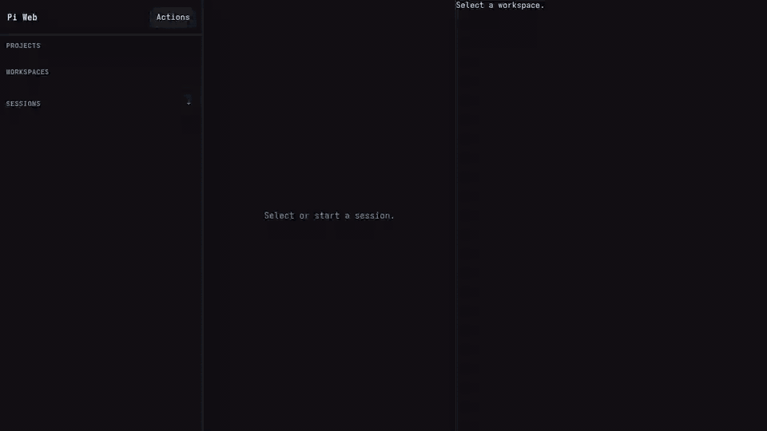

# PI WEB

[](https://github.com/jmfederico/pi-web/actions/workflows/ci.yml)
[](https://www.npmjs.com/package/@jmfederico/pi-web)
[](package.json)
[](LICENSE)
[](https://github.com/earendil-works/pi/tree/main/packages/coding-agent)

Website: <https://pi-web.dev/>


**Run AI coding agents on your own machine or server, keep them alive in real workspaces, and control everything from a browser.**

PI WEB is a web control plane for [Pi Coding Agent](https://github.com/earendil-works/pi/tree/main/packages/coding-agent). Add your repositories once, open project workspaces and git worktrees, start agent sessions inside them, and come back later without losing the work. Your browser becomes the cockpit; your server becomes the persistent development environment. Start on your laptop, check in from your phone, and continue from an iPad or another machine whenever that is the device you have at hand.



With PI WEB you can:

- launch and supervise multiple coding-agent sessions in parallel;
- keep sessions running when your browser disconnects or the UI restarts;
- organize agent work by project, workspace, branch, experiment, or review;
- use git worktrees to isolate concurrent features and fixes;
- chat with Pi Coding Agent through a realtime web UI;
- move fluidly between laptop, phone, tablet, and desktop without moving the development environment;
- turn any server, desktop, or remote dev box into an agent-first development hub.

## Why use PI WEB?

Agentic development works best when agents are not trapped inside a single local terminal. They need stable environments, access to real repositories, and room to work across branches and tasks. Humans need the opposite: a clear place to supervise, redirect, review, and decide.

PI WEB connects those two worlds. The work stays in the server-side environment while you move between devices: laptop for deep focus, phone for a quick check-in, tablet for review, desktop when you are back at a desk. It is not trying to recreate the old desktop IDE in a browser; it is a control surface for persistent, parallel, human-in-the-loop agent work.

## Core model

PI WEB organizes work into four levels:

```text
Machine     a local or remote PI WEB runtime endpoint
Project     a folder on that machine
Workspace   a git worktree, or the project folder for non-git projects
Session     a chat with Pi Coding Agent running inside a workspace
```

This maps naturally to real development work:

- select the local machine or another registered PI WEB runtime;
- add a project once on the selected machine;
- use worktrees to separate branches, features, experiments, and reviews;
- start one or more agent sessions inside each workspace;
- leave sessions running even when the browser disconnects or the UI restarts.

## Features

- Add and list local or remote PI WEB machines from the action palette.
- Proxy remote projects, workspaces, files, git state, sessions, and terminals through the currently opened PI WEB server.
- Add and list server-side projects.
- Discover git worktrees automatically with `git worktree list --porcelain`.
- Support non-git folders as single-workspace projects.
- Start, resume, archive, and restore Pi sessions per workspace.
- Chat with Pi Coding Agent through realtime WebSocket events.
- Keep active agent runtimes alive across browser disconnects and web/API restarts.
- Explicitly stop or abort active session work.
- View live session status: streaming, compaction, bash activity, token usage, cost, model, and context usage.
- Send prompts, shell input, and supported commands through the Pi SDK path.
- Reuse your existing Pi auth and model configuration from `~/.pi/agent`.
- Extend the UI with trusted plugins that add actions, workspace panels, and workspace-label metadata. See [Plugin API](docs/plugins.md) for LLM-friendly plugin-building docs.

## Architecture

PI WEB uses a split-process architecture so agent runtimes are not owned by the browser-facing dev server.

```text
Browser UI
   │
   ▼
Fastify Web/API process
   │ HTTP + WebSocket proxy
   ▼
Session daemon
   │
   ▼
Pi Coding Agent SDK
```

### Session daemon

The session daemon owns active Pi session runtimes. It is intended to be long-lived so sessions can survive browser disconnects and web/API restarts.

### Web/API/UI server

The web process serves the API and browser UI. In development it can autoreload freely while active sessions continue running in the daemon.

## State model

PI WEB keeps its own state intentionally small:

- Machines: `~/.pi-web/machines.json` stores only opt-in remote machine records; the local machine is synthesized.
- Projects: `~/.pi-web/projects.json`
- Workspaces: discovered from git worktrees, not stored
- Sessions and chat history: Pi's default JSONL session storage on the selected machine
- Active session runtimes and WebSockets: memory in each selected machine's session daemon

## Machine federation

The Machines section lets one PI WEB instance act as a gateway to other PI WEB runtimes. Register a remote machine from **Actions → Add Machine** with the remote PI WEB base URL, for example a URL reachable over NetBird, Tailscale, WireGuard, an SSH tunnel, or a trusted reverse proxy. The browser continues talking to the local PI WEB origin; project, workspace, file, git, session, activity, and terminal HTTP/WebSocket traffic is proxied server-to-server. See the [Fleet guide](https://pi-web.dev/machines.html) for setup, trust model, and troubleshooting details.

Remote model-provider credentials and OAuth state stay on the target machine. API-key provider configuration can be proxied, but OAuth login should be completed by opening the remote PI WEB directly. Register remote machines only when you trust the endpoint and the network path: adding a machine gives this PI WEB server permission to contact that URL with the optional bearer token you configured.

## Plugins

PI WEB production installs can load trusted local UI plugins without rebuilding PI WEB. Plugins are browser-side ES modules that can add action-palette actions, workspace panels, and workspace-label metadata, using documented context helpers for workspace files and terminals. They do not run in the session daemon and are not sandboxed.

The supported package shape is intentionally singular: `piWeb.plugins` entries with explicit `id` and `module` plus optional `machineSpecific` metadata, and a browser module that exports `{ apiVersion: 1, name, activate }`. The bundled `pi-web-plugins/info` TypeScript source is the canonical minimal real example, `pi-web-plugins/updates` demonstrates a dynamic status panel, and built-in [Workspace Tasks](docs/plugins.md#workspace-tasks) adds a workspace tab for running configured shell commands in PI WEB terminals.

A useful prompt for AI agents:

```text
Build a PI WEB plugin for this project. Goal: <describe the UI behavior>.
Before coding, read https://pi-web.dev/plugins.html and https://pi-web.dev/plugins.md.
Create it under ~/.pi-web/plugins/<plugin-id> using the documented PI WEB v1 plugin API.
Validate with /pi-web-plugins/manifest.json and explain reload/debug steps.
Do not modify PI WEB itself.
```

Manage discovered plugins in **Settings → Plugins** or with the top-level `plugins` config key. Plugins are enabled by default; set `plugins.<plugin-id>.enabled` to `false` and reload the browser tab to prevent PI WEB from importing that plugin.

Reload the browser tab after adding or editing a plugin. If `PI_WEB_DATA_DIR` is set, use `$PI_WEB_DATA_DIR/plugins` instead of `~/.pi-web/plugins`. Check discovery with:

```bash
curl http://127.0.0.1:8504/pi-web-plugins/manifest.json
```

See the full [Plugin API](docs/plugins.md) for contribution types, package metadata, and troubleshooting.

## Install

Recommended install uses npm plus native per-user services.

```bash
npm install -g @jmfederico/pi-web
pi-web install
```

On Linux servers, `loginctl enable-linger` is optional but recommended so the user systemd manager starts at boot and continues running after logout:

```bash
sudo loginctl enable-linger "$USER"
loginctl show-user "$USER" -p Linger
```

This writes and starts PI WEB's session daemon and web/API user services. The native user-service backend is selected automatically.

The generated services run through your detected login shell (`bash`, `zsh`, or `fish` with `-lc`) so they see a shell environment similar to running `pi` from your terminal.

Open <http://127.0.0.1:8504>.

Useful commands:

```bash
pi-web status
pi-web logs
pi-web restart
pi-web doctor
pi-web version
pi-web uninstall
```

Use `pi-web version` to compare the installed package version with the versions reported by the running Web/UI and session daemon services.

One-line install is also available for users who prefer it:

```bash
curl -fsSL https://raw.githubusercontent.com/jmfederico/pi-web/main/install.sh | sh
```

PI WEB is also published as a Pi package. Installing it through Pi exposes a `/pi-web` command inside Pi:

```bash
pi install npm:@jmfederico/pi-web
```

Then in Pi:

```text
/pi-web install
/pi-web status
/pi-web logs
/pi-web restart
/pi-web doctor
/pi-web version
```

The Pi command is a convenience wrapper around the same service installer. When installed this way, the service installer can use PI WEB's package-local server entrypoints, so `pi-web-server` and `pi-web-sessiond` do not need to be on your shell `PATH`. `/pi-web logs` shows the last 100 service log lines; use `pi-web logs` in a shell when you want to follow logs continuously.

Advanced users may run the binaries however they prefer:

```bash
pi-web-sessiond
PI_WEB_PORT=8504 pi-web-server
```

## Development quick start

```bash
npm install
npm run dev
```

Open the Vite URL, usually <http://localhost:8505>.

During development, the static marketing/docs site is also served by the Vite dev server at <http://localhost:8505/site/>.

For the recommended split development setup, run these in separate terminals:

```bash
npm run dev:sessiond
npm run dev:web
npm run dev:client
```

Or install the split development setup as native per-user services from the checkout:

```bash
pi-web install --dev
```

`pi-web install --dev` writes the session daemon plus a UI development service using the native user-service backend. `pi-web uninstall` removes both production and development service files; no uninstall flags are needed.

`dev:web` also watches bundled plugin TypeScript and rebuilds the browser-loaded plugin JavaScript under `dist/pi-web-plugins/`. You can restart `dev:web` or `dev:client` without stopping active Pi sessions.

## Production-style run from a checkout

```bash
npm run build
npm run start:sessiond
PI_WEB_PORT=8504 npm start
```

## Packaging and publishing

```bash
npm run verify
npm run pack:dry
npm publish --access public
```

`prepack` builds `dist/` and bundled plugin JavaScript before npm creates the tarball, and `prepublishOnly` runs verification before publishing. Releases can also be published by the GitHub Actions npm workflow when a GitHub release is published.

PI WEB uses a single-line CalVer-inspired npm version: `MAJOR.YYYYMM.SEQUENCE`, for example `1.202605.1`. The major number signals breaking-change eras; the middle number is the release month; the final number increments for additional releases in that month. Older major eras may be deprecated rather than maintained in parallel.

PI WEB declares `@earendil-works/pi-coding-agent` as a peer dependency (`>=0.74.0 <1`) and a development dependency for local builds. This keeps published installs flexible: npm 7+ installs the peer automatically, and users can upgrade the Pi package within the compatible range without PI WEB pinning a separate copy.


The web server defaults to `127.0.0.1:8504`. Set `PI_WEB_HOST=0.0.0.0` only when you intentionally want to bind directly on all interfaces.

The session daemon defaults to a private Unix socket at:

```text
~/.pi-web/sessiond.sock
```

Environment variables:

- `PI_WEB_PORT` / `PORT` — web server port. Defaults to `8504`.
- `PI_WEB_HOST` — web server bind host. Defaults to `127.0.0.1`.
- `PI_WEB_DATA_DIR` — PI WEB data directory. Defaults to `~/.pi-web`.
- `PI_WEB_SESSIOND_SOCKET` — Unix socket path used by both the daemon and web process when `PI_WEB_SESSIOND_URL` is not set. Defaults to `$PI_WEB_DATA_DIR/sessiond.sock`.
- `PI_WEB_SESSIOND_PORT` — optional TCP port for the daemon. If unset, the daemon listens on the Unix socket instead.
- `PI_WEB_SESSIOND_HOST` — daemon TCP bind host when `PI_WEB_SESSIOND_PORT` is set. Defaults to `127.0.0.1`.
- `PI_WEB_SESSIOND_URL` — daemon URL used by the web process when connecting over TCP, for example `http://127.0.0.1:3001`. If you set `PI_WEB_SESSIOND_PORT`, set this for the web process too.
- `PI_WEB_PROJECTS_FILE` — optional override for the projects storage JSON file. Defaults to `$PI_WEB_DATA_DIR/projects.json`.
- `PI_WEB_MACHINES_FILE` — optional override for the remote machine registry JSON file. Defaults to `$PI_WEB_DATA_DIR/machines.json`.
- `PI_CODING_AGENT_SESSION_DIR` — Pi session storage directory. PI WEB follows the same session-location priority as Pi for web sessions: this environment variable, then `sessionDir` in Pi settings for the selected workspace, then Pi's default session directory.
- `PI_CODING_AGENT_DIR` — Pi agent config directory. PI WEB uses this for Pi auth, settings, resources, and default session storage, matching Pi's own configuration layout.

## Development services

`pi-web install --dev` creates a practical local setup with two native per-user services:

- `pi-web-sessiond` runs `npm run start:sessiond` from the checkout without autoreload.
- `pi-web-ui-dev` runs `npm run dev:web` and `npm run dev:client` for API reloads, bundled plugin rebuilds, and Vite HMR.

Under the hood, the native backends are systemd user services and LaunchAgents. For reference, an equivalent systemd setup looks like:

```ini
# ~/.config/systemd/user/pi-web-sessiond.service
[Unit]
Description=PI WEB session daemon

[Service]
Type=simple
WorkingDirectory=/srv/dev/pi-web
ExecStart=/bin/bash -lc 'exec npm run start:sessiond'
Restart=no

[Install]
WantedBy=default.target
```

```ini
# ~/.config/systemd/user/pi-web-ui-dev.service
[Unit]
Description=PI WEB UI dev server
After=pi-web-sessiond.service
Wants=pi-web-sessiond.service

[Service]
Type=simple
WorkingDirectory=/srv/dev/pi-web
ExecStart=/bin/bash -lc 'trap "kill 0" EXIT; npm run dev:web & npm run dev:client & wait'
Restart=no

[Install]
WantedBy=default.target
```

On Linux servers, enable persistent user services so the user systemd manager starts at boot and remains running after logout:

```bash
sudo loginctl enable-linger "$USER"
loginctl show-user "$USER" -p Linger
```

Install or refresh the development services with:

```bash
pi-web install --dev
```

Useful logs:

```bash
pi-web logs
```

If code affecting the session daemon changes, restart it manually:

```bash
pi-web restart
```

## Current limitations

- Assumes trusted users and trusted server paths.
- Not a sandbox, permission model, or secure multi-tenant platform.
- Some Pi TUI slash-command behavior is not yet represented exactly in the web UI.
- Workspaces are discovered from existing git worktrees; UI-driven worktree management is a natural next step.

## Vision

PI WEB is the beginning of an agent-first development environment:

- agents run persistently on servers;
- humans connect through the browser;
- work is organized by projects, workspaces, and sessions;
- the UI grows around the needs of agentic development rather than the habits of local IDEs.

The goal is simple: make it practical to run more development remotely, in parallel, with agents as first-class participants and humans focused on direction, judgment, and review.

## License

MIT © 2026 Federico Jaramillo Martinez. See [LICENSE](LICENSE).
